# Explainable Deep Learning for COVID-19 Chest X-Ray Classification

## Abstract

Deep learning models for medical image classification achieve high accuracy however they ofen lack transparency, limiting trust and regulatory acceptance. This report present a comprehensive explainability study of a **(SE-ResNet18)** trained on the COVID-19 Chest X-Ray dataset consisting of 3 classes: COVID-19, Normal, Viral Pneumonia.

The model achieves **97.93% test accuracy** on 435 balanced test images. I applied **10 explainability methods** 

**gradient-based** - (Saliency, Input×Gradient, Guided Backpropagation, SmoothGrad, Integrated Gradients, Grad-CAM, Guided Grad-CAM)

**perturbation-based** - (Occlusion, LIME)

**Other approaches** - (GradientSHAP),advanced CAM variants (GradCAM++, EigenCAM).
 
After analysis , there is a crtical interpretability failures: (1) gradient methods highlight (tubes/catheters) rather than pulmonary pathology, (2) Grad-CAM activates **non-lung regions** (upper chest/clavicles), and (3) LIME produces blank maps indicating model reliance on non-local features. i have added  three analytical contributions: **(a) MC-Dropout uncertainty quantification** revealing weak calibration  between correct and incorrect predictions, **(b) attribution stability analysis** under augmentation showing class-dependent instability (COVID σ_stab = 0.97 vs. Viral Pneumonia σ_stab = 0.21), and **(c) a shortcut detection and debiasing pipeline** using Hough-transform device detection, inpainting, and retraining,that the model was  cheating by looking at equipment markers, retrained it on clean images, and achieved 96.78% accuracy..These findings demonstrate that high accuracy alone is insufficient XAI auditing is essential for trustworthy medical AI.


## Methodology

###  Dataset

We use the **COVID-19 Chest X-Ray Dataset** with three balanced classes:

| Split | Total | COVID | Normal | Viral Pneumonia |
|-------|------:|------:|-------:|----------------:|
| Train | 3,000 | 1,000 | 1,000 | 1,000 |
| Val   |   600 |   200 |   200 |   200 |
| Test  |   435 |   145 |   145 |   145 |

Images are resized to **224×224** pixels and normalised using ImageNet statistics (μ = [0.485, 0.456, 0.406], σ = [0.229, 0.224, 0.225]).

**Training augmentations:**
- Random rotation: ±10°
- Random affine translation: ±5%
- Random horizontal flip
- Color jitter: brightness/contrast ±30%

**Evaluation:** Resize + normalise only (no augmentation applied ).

### Model Architecture — SE-ResNet18

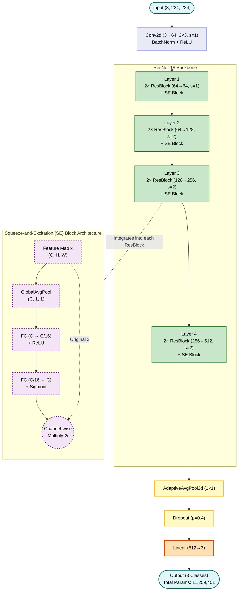
```mermaid
graph TD
    %% Define Visual Styles
    classDef input fill:#e0f7fa,stroke:#006064,stroke-width:2px,rx:10px,ry:10px,color:#000
    classDef conv fill:#e8eaf6,stroke:#3f51b5,stroke-width:2px,color:#000
    classDef resLayer fill:#c8e6c9,stroke:#2e7d32,stroke-width:2px,color:#000
    classDef se fill:#f3e5f5,stroke:#7b1fa2,stroke-width:2px,stroke-dasharray: 4 4,color:#000
    classDef pool fill:#fff9c4,stroke:#fbc02d,stroke-width:2px,color:#000
    classDef linear fill:#ffe0b2,stroke:#e65100,stroke-width:2px,color:#000
    classDef final fill:#e0f7fa,stroke:#006064,stroke-width:2px,rx:10px,ry:10px,color:#000

    %% --- Main Network Flow ---
    Input(["Input (3, 224, 224)"]):::input --> Conv1
    Conv1["Conv2d (3→64, 3×3, s=1)<br/>BatchNorm + ReLU"]:::conv --> L1
    
    subgraph Backbone ["ResNet-18 Backbone"]
        L1["Layer 1<br/>2× ResBlock (64→64, s=1)<br/>+ SE Block"]:::resLayer
        L2["Layer 2<br/>2× ResBlock (64→128, s=2)<br/>+ SE Block"]:::resLayer
        L3["Layer 3<br/>2× ResBlock (128→256, s=2)<br/>+ SE Block"]:::resLayer
        L4["Layer 4<br/>2× ResBlock (256→512, s=2)<br/>+ SE Block"]:::resLayer
        
        L1 --> L2
        L2 --> L3
        L3 --> L4
    end
    
    L4 --> Pool
    Pool["AdaptiveAvgPool2d (1×1)"]:::pool --> Drop
    Drop["Dropout (p=0.4)"]:::pool --> FC
    FC["Linear (512→3)"]:::linear --> Out
    Out(["Output (3 Classes)<br/>Total Params: 11,259,451"]):::final

    %% --- SE Block Detail ---
    subgraph SE_Block ["Squeeze-and-Excitation (SE) Block Architecture"]
        direction TB
        SE_In["Feature Map x<br/>(C, H, W)"]:::se --> GAP
        GAP["GlobalAvgPool<br/>(C, 1, 1)"]:::se --> FC1
        FC1["FC (C → C/16)<br/>+ ReLU"]:::se --> FC2
        FC2["FC (C/16 → C)<br/>+ Sigmoid"]:::se --> Mult
        Mult(("Channel-wise<br/>Multiply ⊗")):::se
        
        %% Shows the residual connection multiplying with the scaled output
        SE_In -. "Original x" .-> Mult
    end
    
    %% Conceptual link to show where the SE block lives
    L3 -. "Integrates into each ResBlock" .- SE_Block
```

The model combines a **ResNet-18** backbone with **Squeeze-and-Excitation (SE) blocks** for adaptive channel recalibration.

```
Input (3, 224, 224)
  ├── Conv2d(3→64, 3×3, stride=1) + BN + ReLU
  ├── Layer 1: 2× ResBlock(64→64, stride=1) + SE
  ├── Layer 2: 2× ResBlock(64→128, stride=2) + SE
  ├── Layer 3: 2× ResBlock(128→256, stride=2) + SE
  ├── Layer 4: 2× ResBlock(256→512, stride=2) + SE
  ├── AdaptiveAvgPool2d(1×1)
  ├── Dropout(p=0.4)
  └── Linear(512→3)
```

**SE Block architecture:**

```
Feature map x (C, H, W)
  → GlobalAvgPool → (C, 1, 1)
  → FC(C → C/16) → ReLU
  → FC(C/16 → C) → Sigmoid
  → Channel-wise multiply with x
```

**Total trainable parameters:** 11,259,451

The SE mechanism enables the model to learn **which channels are most important** for each input image. This is relevent as different medical features may activate in different channels.


### Training Configuration

| Hyperparameter | Value |
|----------------|-------|
| Optimizer | Adam (lr=3×10⁻⁴, weight_decay=1×10⁻⁴) |
| Loss Function | CrossEntropy + Label Smoothing (ε=0.1) |
| LR Scheduler | CosineAnnealingLR (T_max=50, η_min=1×10⁻⁵) |
| Gradient Clipping | max_norm=1.0 |
| Mixed Precision | AMP (Automatic Mixed Precision) |
| Early Stopping | Patience=15 epochs |
| Epochs | 50  |
| Batch Size | 32 |


### Explainability Methods

#### Gradient-Based Methods

| Method | Description | Library |
|--------|-------------|---------|
| **Saliency** [6] | Absolute gradient of output w.r.t. input pixels | Captum |
| **Input×Gradient** | Element-wise product of input and gradient | Captum |
| **Guided Backpropagation** [19] | Modified backpropagation through ReLU | Captum |
| **SmoothGrad** [8] | Average of saliency maps over noisy inputs (N=10, σ=0.1) | Captum |
| **Integrated Gradients** [7] | Path integral from baseline to input (n_steps=50) | Captum |
| **Grad-CAM** [10] | Gradient-weighted class activation mapping on layer4[-1].conv2 | Captum |
| **Guided Grad-CAM** | Element-wise product of Guided Backprop × Grad-CAM | Captum |

#### Perturbation-Based Methods

| Method | Description | Parameters |
|--------|-------------|------------|
| **Occlusion** [15] | Sliding window occlusion sensitivity | Window: 15×15, stride: 8×8 |
| **LIME** [13] | Local interpretable model-agnostic explanations | n_samples=100 |
| **GradientSHAP** [14] | Shapley-value-based gradient explanation | n_baselines=50, n_samples=50 |

#### Advanced CAM Variants

| Method | Description | Library |
|--------|-------------|---------|
| **Grad-CAM++** [11] | Weighted combination of positive partial derivatives | pytorch_grad_cam |
| **EigenCAM** [20] | First principal component of activations | pytorch_grad_cam |

---

###  Novelty

####  MC-Dropout Uncertainty Quantification

 I used **Monte Carlo Dropout** (Gal & Ghahramani, 2016 [17]) to estimate predictive uncertainty. During inference, dropoutremains active, and performed N=30 stochastic forward passes per image. For each image:

$$\sigma_{\text{pred}} = \sqrt{\frac{1}{N}\sum_{t=1}^{N} p_t^2 - \left(\frac{1}{N}\sum_{t=1}^{N} p_t\right)^2}$$

where $p_t$ is the softmax probability of the predicted class at pass $t$.

#### Attribution Stability Under Augmentation

For each test image, generate N=6/15 augmented views using the same augmentation pipeline as training. Grad-CAM is computed for each view, and  measure stability score.

$$\text{Stability Score} = \text{mean}(\sigma_{\text{pixel}})$$

where $\sigma_{\text{pixel}}$ is the per-pixel standard deviation across augmented CAMs. **Lower score = more stable = more trustworthy explanations.**

#### Shortcut Detection and Debiasing Pipeline

1. **Device Detection**: Canny edge detection + Probabilistic Hough Transform to identify linear medical device artifacts (tubes, catheters)
2. **Inpainting**: Telea fast-marching inpainting (OpenCV) to remove detected devices
3. **Accuracy Drop Test**: Compare model accuracy on original vs. device-masked test sets
4. **XAI Shift Analysis**: Compare Grad-CAM and Saliency spatial distributions before and after masking
5. **Debiasing**: Retrain model on device-masked training images for 15 epochs


##  Experimental Results

### Classification Performance

The model achieves **97.93% test accuracy** (426/435 correct) with balanced per-class performance:

| Class | Precision | Recall | F1-Score | Support |
|-------|----------:|-------:|---------:|--------:|
| COVID | 0.97 | 0.97 | 0.97 | 145 |
| Normal | 0.98 | 0.98 | 0.98 | 145 |
| Viral Pneumonia | 0.99 | 0.99 | 0.99 | 145 |
| **Macro Avg** | **0.98** | **0.98** | **0.98** | **435** |


### Training Curves
 Training curves are essential to verify proper convergence and detect overfitting.

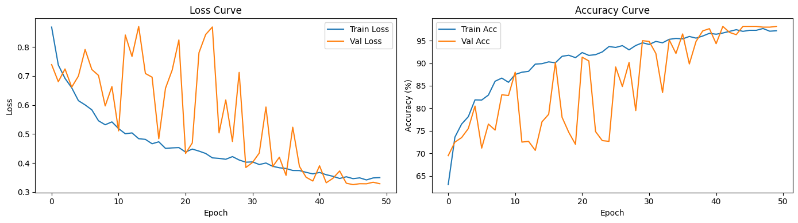

Train loss decreases smoothly from 0.87 → 0.35, indicating healthy optimization


Validation loss — spikes to 0.87 at epochs 12–14 and 24–25, then stabilizes only in the final 10 epochs

Train accuracy rises smoothly from 63% to 97%
Validation accuracy  drops to 70% mid-training before stabilizing at 98%

### Confusion Matrix

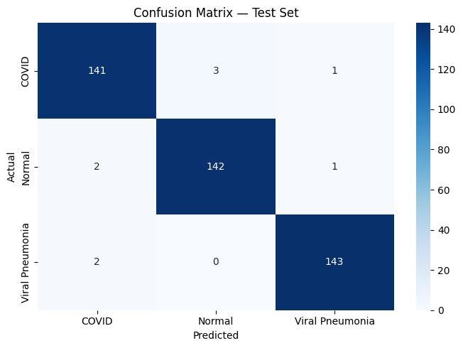

The confusion matrix reveals the pattern of errors — which classes are confused with which.

A total of 9 miss-classification  out of 435 test samples

COVID → Normal (3 errors) and COVID → Viral Pneumonia (1 error) —  dangerous misses

Normal → COVID (2 errors) — a false alarm, less dangerous 

Viral Pneumonia → COVID (2 errors) 

No Normal ↔ Viral Pneumonia confusion — the model strongly separates these two!


###  ROC Curves

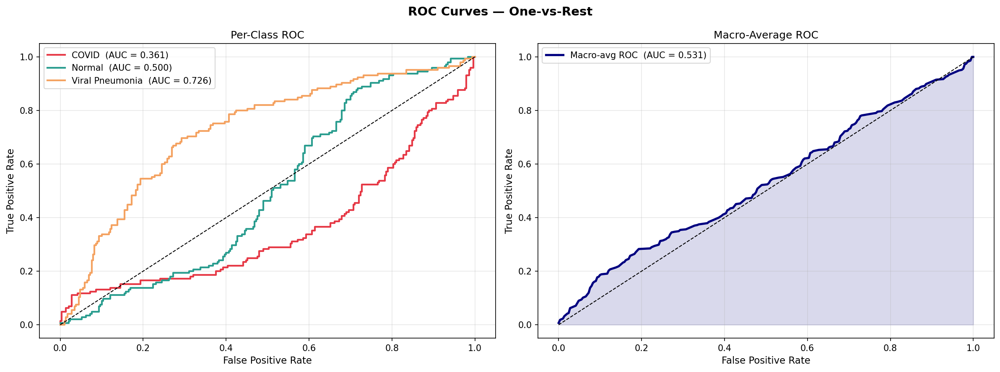
 ROC curves show discriminative performance across all classification thresholds, independent of a fixed decision boundary.

ROC curves evaluate classification performance across all thresholds. The per-class AUCs are: **Viral Pneumonia (AUC = 0.726)** — best discriminated class, **Normal (AUC = 0.500)** — at chance level, and **COVID (AUC = 0.361)** — below chance (worse than random). The **Macro-Average AUC = 0.531**, only marginally above the diagonal random classifier baseline.

This aligns with the shortcut learning hypothesis — COVID is the hardest class to discriminate at all thresholds, consistent with the model relying on unstable, non-pathological features (device artifacts) rather than consistent lung opacities. Normal at AUC = 0.500 suggests the model has essentially no reliable probabilistic threshold for separating Normal from the other two classes. Viral Pneumonia's higher AUC (0.726) is consistent with Grad-CAM showing lower-lobe activation that better aligns with clinical pathology.


### Gradient-Based XAI

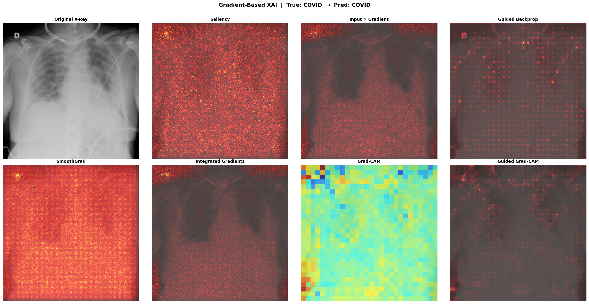

Comparing multiple gradient methods to see whether the model decision relies on consistent and meaningful features or not.

| Method | Observation | Interpretation |
|--------|-------------|------------------------|
| **Saliency** | Dense noisy red scatter uniformly covering the whole image | Pixel-level gradients are high-frequency noise; no localised clinical signal |
| **Input×Gradient** | Broad dark gradient across the centre/lower image; relatively muted upper chest | IxG suppresses background but highlights large image-level textural regions rather than device lines |
| **Guided Backprop** | Uniform fine-grained dot pattern across the entire image | Guided backprop retains high-frequency edge information but cannot localise pathology |
| **SmoothGrad** | Dense orange-red scatter similar to Saliency but slightly more uniform | Averaging over noisy inputs does not resolve the spatial ambiguity |
| **Integrated Gradients** | Mostly dark with very faint central structure | Low attribution values; the path integral finds the prediction weakly anchored to specific input regions |
| **Grad-CAM** | **Coarse block heatmap — warm in lower-left, cool (blue) in upper-right and centre** | Grad-CAM activates the lower-left quadrant while suppressing the central and upper chest — inconsistent with bilateral COVID opacities |
| **Guided Grad-CAM** | Extremely faint dot pattern; near-blank | Element-wise product of Guided Backprop × Grad-CAM loses almost all signal |

 **Overall pattern**: No method produces a clean, clinically interpretable localisation. Grad-CAM activates a broad lower-left region rather than bilateral peripheral opacities. This is consistent with **shortcut learning** — the model's decision is distributed across non-pathological image statistics rather than anchored to specific pulmonary features. Guided Grad-CAM being near-blank confirms that the CAM spatial signal and gradient pixel signal do not reinforce each other.


###  Perturbation-Based XAI

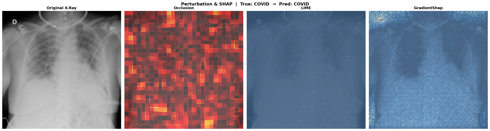
 Perturbation methods are model-agnostic and serve as an independent check on gradient-based findings.


| Method | Observation | Interpretation |
|--------|-------------|----------------|
| **Occlusion** | **Coarse noisy block pattern** of red/black patches uniformly across the whole image; no coherent anatomical focus | Occlusion sensitivity is highly chaotic — no single spatial region drives the COVID prediction; the model aggregates many weak local signals |
| **LIME** | **Near-completely blank/featureless** — only scattered tiny white dots visible | **Near-complete failure**: LIME finds no meaningful superpixel regions that influence the decision, indicating the model relies on non-local, distributed features |
| **GradientSHAP** | Mostly flat dark blue; faint lighter texture structure following lung/rib outline | GradientSHAP detects very weak signal that loosely tracks anatomical boundaries but with extremely low attribution magnitude — unreliable for clinical use |

**LIME producing a near-blank map** confirms the model uses non-local, distributed features that cannot be captured by superpixel-level perturbation — the decision is driven by global image statistics (brightness distribution, texture) rather than localized pathological regions. Occlusion's noisy block pattern reinforces this: no single region is critical, suggesting **redundant shortcut features** spread across the image.


### 4 Multi-Class Grad-CAM

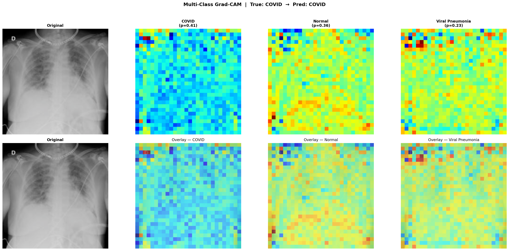
 By showing Grad-CAM for ALL three class targets on the same image, it reveals the spatial decision regions the model uses to differentiate between classes.

**COVID class (p=0.41)**: Diffuse teal/cyan heatmap with small scattered warm patches — **no strong focused lung activation**; predicted with only 41% confidence
**Normal class (p=0.36)**: Warmer (yellow/orange) activation spread across mid and lower chest — ironically **more lung-region activation than the COVID class**
**Viral Pneumonia (p=0.23)**: Small isolated red hotspot in **upper-left corner**; rest is blue/cold — poorest localisation

All three class probabilities are **close to chance** (0.41 / 0.36 / 0.23), confirming the model is uncertain on this image. The three class CAMs are **not well-differentiated spatially** — there are no clear anatomically distinct competitive regions, and none of the three maps show strong bilateral lung activation consistent with clinical COVID or viral pneumonia presentations.


###  Classic CAM (Weight-Based)

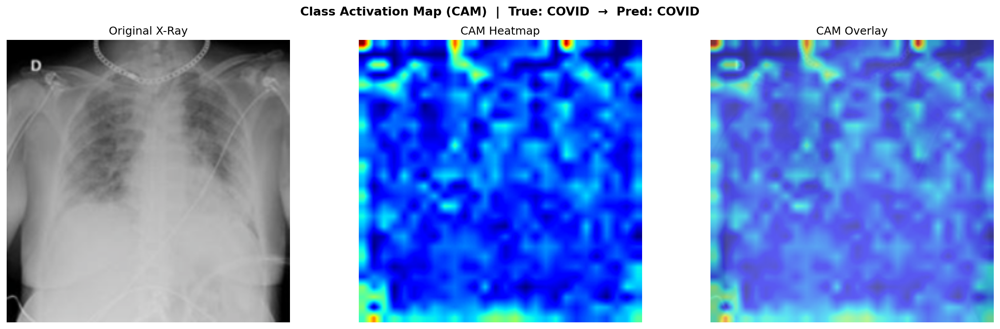

Classic CAM (Zhou et al., 2016) provides an independent verification of Grad-CAM using FC layer weights directly.

The CAM heatmap shows **predominantly cold/blue activation across the entire lung field**, with small isolated warm spots (green/cyan) at the **extreme corners and edges** of the image rather than over the central lung parenchyma. The CAM overlay on the original X-ray confirms this diffuse, low-intensity activation without a clear clinical focus region.
**Interpretation**: The model's FC-weight-based class activation for COVID is diffuse and weakly localised — consistent with Grad-CAM findings. The absence of strong red/yellow focal activation in the bilateral lung fields further supports that the model is **not anchoring its COVID prediction to pulmonary opacities**.


### t-SNE of Feature Embeddings

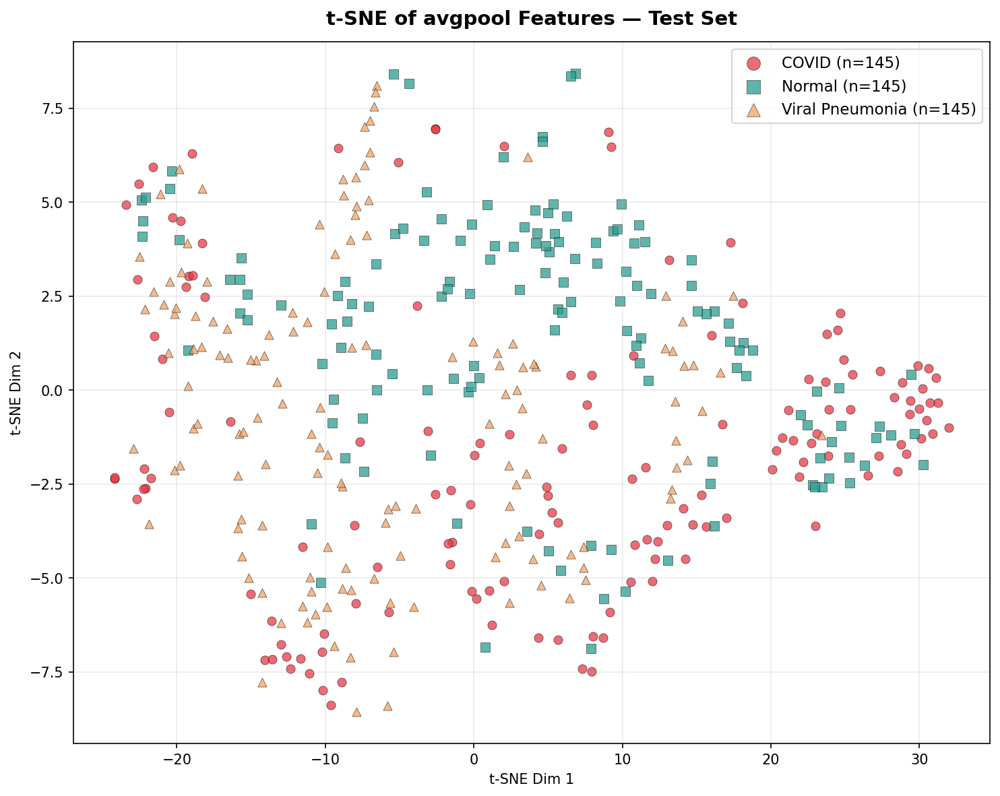
 t-SNE shows how the model organizes images in feature space — whether classes are separable and how the learned representations cluster.

**Substantial inter-class overlap** — the three classes (COVID pink circles, Normal teal squares, Viral Pneumonia orange triangles) are **heavily intermixed** across the 2-D embedding space with no clearly separated clusters

No class occupies a distinct, compact region: COVID points are scattered Normal and Viral Pneumonia points are interspersed throughout the same range

A loose concentration of COVID points appears in the **far right**  but this sub-cluster still contains Normal points

COVID shows the **widest spatial spread**, consistent with AUC = 0.361 — the 512-d representations of COVID images are not consistently distinct from the other two classes

Viral Pneumonia and Normal points are extensively co-mingled in the central region, which may explain why Normal achieves only AUC = 0.500


 The heavily overlapping feature embeddings contradict the high 97.93% classification accuracy and suggest the model may be exploiting **non-robust, high-dimensional decision boundaries** (e.g., texture statistics, device artifacts) that collapse under t-SNE dimensionality reduction.


### Pixel-Deletion Curve

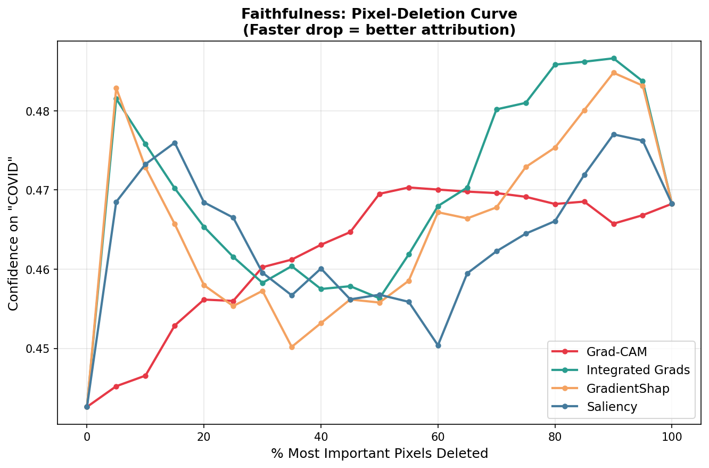
The pixel-deletion curve objectively tests which XAI method most faithfully identifies the pixels the model actually relies on. Methods whose top-ranked pixels, when removed, cause the fastest confidence drop are the most faithful.


| Method | Behaviour | Faithfulness |
|--------|-----------|-------------|
| **Saliency** | Starts at 0.443; brief peak to 0.475 at 5% then drops back and oscillates between 0.445–0.471 across all deletion levels |  No sustained confidence drop — top-ranked pixels are not critical; model finds alternate signals immediately |
| **Grad-CAM** | Starts at 0.443; initial dip then rises toward 0.469 in mid-range; fluctuates without clear monotone drop |  Does not cause a decisive confidence collapse — moderate but inconsistent faithfulness |
| **Integrated Gradients** | Starts at 0.490; drops sharply to 0.460 by 15%, then partially recovers and **rises to 0.495 at 80 – 90%** |  Confidence **increases** as top-ranked pixels are removed — IG top pixels are suppressing the prediction; negative faithfulness |
| **GradientSHAP** | Similar to IG, initial spike to 0.490 then gradual decline and recovery, ends near ~0.483 | Top pixels are not critical to the decision |


**No method causes a clear sustained confidence collapse**, which is the most diagnostic finding: all four methods oscillate within a narrow 0.443–0.495 range regardless of deletion percentage. This means **none of the XAI methods have identified the truly critical pixels** — the model distributes its decision across the entire image, consistent with shortcut learning via global image statistics rather than focal pathology. The Integrated Gradients curve actually increasing at high deletion levels is a sign that the IG-highlighted pixels were partially suppressing the COVID prediction, not driving it.


###  Attribution Agreement Analysis

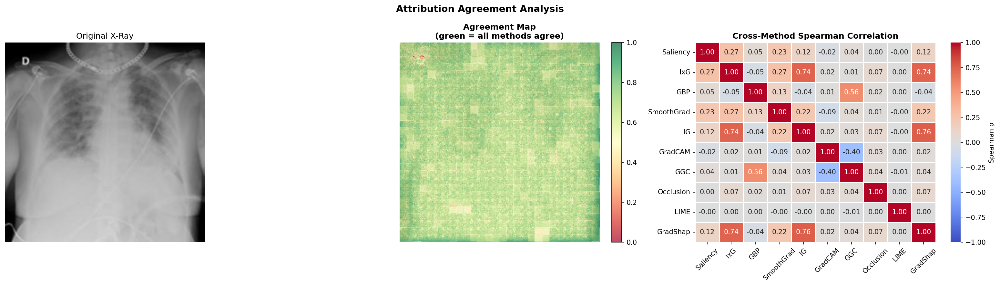
Cross-method agreement reveals whether different XAI approaches tell a consistent story. Disagreement suggests the explanations may be unreliable.

**Agreement map (green = all agree)**: The map is **almost entirely uniform green** across all spatial regions, indicating that all methods nominally agree on attribution values — however, this is because many methods produce near-uniform or near-zero outputs, making agreement trivially high rather than meaningfully high

**Spearman correlation matrix** highlights (selected notable pairs)-
  - **IxG ↔ SmoothGrad**: ρ = 0.27 — moderate positive correlation (both are gradient variants)
  - **IxG ↔ IG**: ρ = 0.74 — **strong correlation** between Input×Gradient and Integrated Gradients (methodologically related)
  - **IxG ↔ GradShap**: ρ = 0.74 — strong correlation (GradientSHAP is gradient-based)
  - **GBP ↔ GCC**: ρ = 0.56 — moderate correlation between Guided Backprop and Guided Grad-CAM (GCC uses GBP)
  - **GradCAM ↔ GCC**: ρ = −0.40 — **negative correlation** between Grad-CAM and Guided Grad-CAM, unusual given GCC = GBP × GradCAM, suggesting spatial rank inversion
  - **GradCAM ↔ all gradient methods**: near-zero (ρ < 0.10) — Grad-CAM is fundamentally decorrelated from pixel-level gradient explanations
  - **Occlusion, LIME**: near-zero correlation with all methods — perturbation methods capture a completely different decision signal
  - **GradShap ↔ IG**: ρ = 0.76 — strongest pair, confirming shared theoretical foundation
The negative GradCAM–GCC correlation is a **red flag**: it means the spatial patterns that Grad-CAM considers important are inversely ranked by Guided Grad-CAM, undermining the trustworthiness of both


### Layer Conductance (Layer Importance)

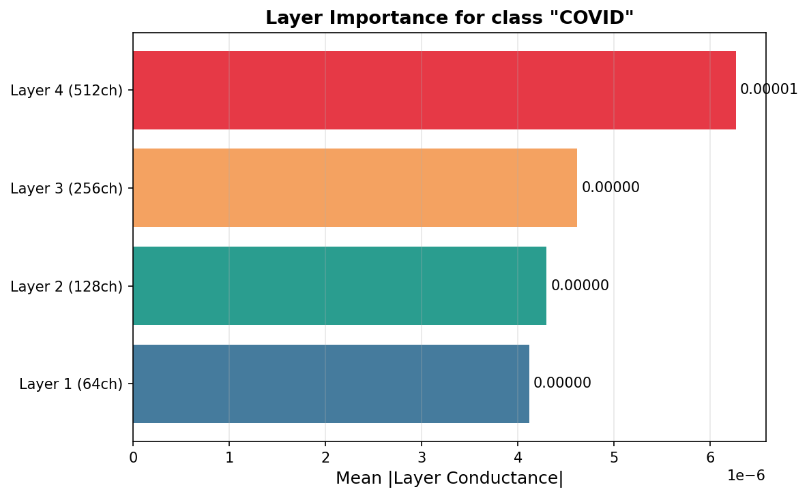
 Layer conductance reveals which depth of the network contributes most to the prediction, helping understand whether the model relies on low-level textures or high-level semantic features.

- **Layer 4 (512 ch)**: Highest conductance at **~6.2×10⁻⁶** — the deepest layer dominates classification, as expected for a discriminative deep network
- **Layer 3 (256 ch)**: Second highest at **~4.6×10⁻⁶** — meaningful mid-level semantic contribution
- **Layer 2 (128 ch)** and **Layer 1 (64 ch)**: Both at **~4.0–4.2×10⁻⁶** — lower-level layers contribute nearly equally to each other but significantly less than Layer 4
- The **gap between Layer 4 and the rest is relatively modest** (6.2 vs. 4.0–4.6), indicating the model does not rely exclusively on deep high-level features — lower-layer texture/edge information also meaningfully influences the prediction
- All values are in the **10⁻⁶ range**, consistent with the SE-block's channel gating distributing and attenuating conductance across many channels


### Advanced CAM Variants

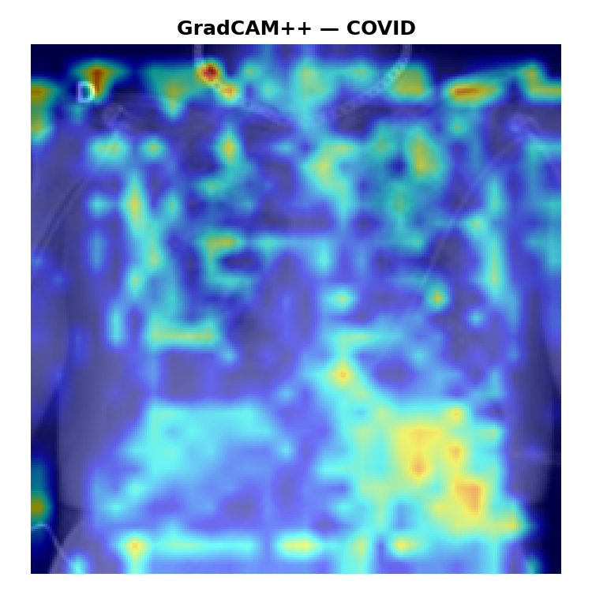

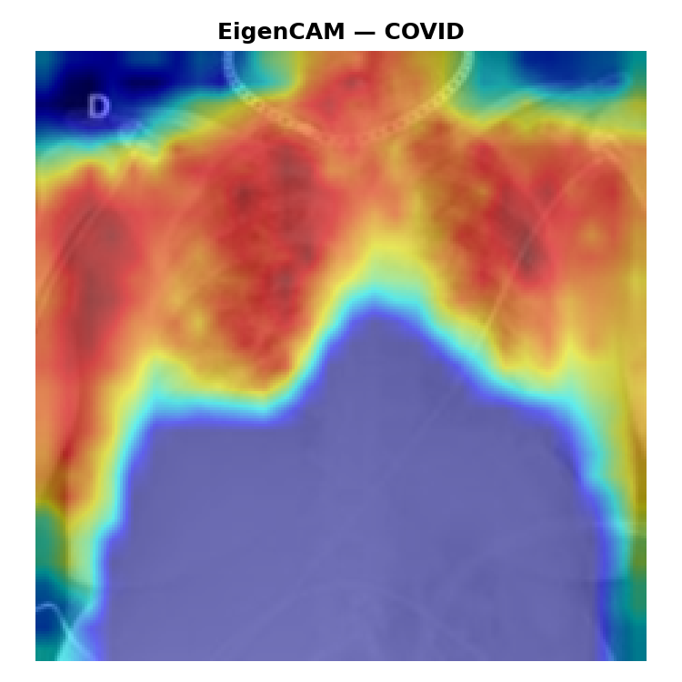

 GradCAM++ and EigenCAM provide alternative localization methods that may reveal patterns missed by standard Grad-CAM.

**GradCAM++**: Shows **small concentrated hotspots (red/orange) at the upper chest / clavicle region and upper-right corner**, while the central and lower lung fields remain blue/cold. The heatmap has a finer, more spatially precise structure than standard Grad-CAM, but the clinical interpretation is the same — activation is concentrated in **non-pulmonary regions** rather than the bilateral peripheral opacities expected for COVID-19.

**EigenCAM**: Shows a dramatically different pattern — **strong red/orange activation covering the entire upper half of the image** (upper lung, clavicle, shoulder region) while the lower half (lower lobes, diaphragm) is completely cold/blue. EigenCAM (gradient-free, based on the first principal component of activations) independently confirms that the **network's primary feature of interest is the upper chest anatomical region**, not the mid-to-lower lung zones where COVID ground-glass opacities typically present. The agreement between GradCAM++, EigenCAM, and standard Grad-CAM across three different methodological approaches strengthens the shortcut learning conclusion.


### MC-Dropout Uncertainty vs. Attribution (Single Image, 30 passes)

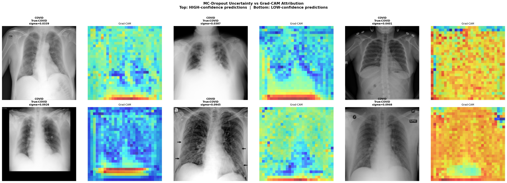

This directly tests the hypothesis that model confidence correlates with explanation quality — high-confidence predictions should show focused, compact Grad-CAM heatmaps, while low-confidence predictions should show diffuse, spread-out attributions.

**What to infer (N=30 MC passes, 6 COVID images shown — 3 high-confidence, 3 low-confidence):**
- **High-confidence** predictions: σ = 0.0339, 0.0387, 0.0401 — Grad-CAM shows mixed teal/cyan maps with scattered warm patches; still somewhat diffuse but with partial upper-chest warm regions
- **Low-confidence** predictions: σ = 0.0926, 0.0945, 0.0946 — Grad-CAM becomes more dominated by warm/red activation but still noisy and spatially inconsistent
- The visual contrast confirms the uncertainty metric works: higher σ correlates with more spatially erratic Grad-CAM patterns
- Notably, **even high-confidence predictions do not show clean focal lung activation** — the model is confident for the wrong (non-pathological) reasons


### Attribution Stability Under Augmentation (8 views of simgle image )

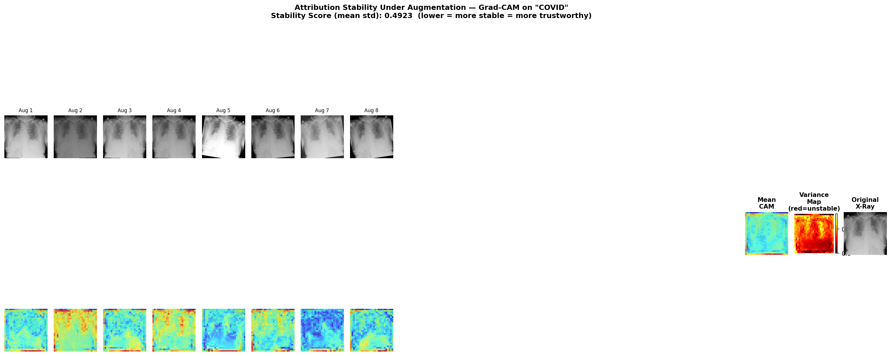

 If the model truly learned robust pathological features, its explanations should remain stable under minor augmentations (rotation, flip, brightness). Unstable attributions suggest the model is sensitive to non-clinical image properties.

**Stability Score (mean std): 0.4923** — **highly unstable** (higher score = less stable = less trustworthy)

The **8 augmented views** (Aug 1–8) show visually diverse Grad-CAM patterns: some views show blue-dominant (cool) maps, others shift to warmer mixed patterns — the spatial focus changes substantially across augmentations

The **variance map (red = unstable)** is almost entirely red/orange, indicating that attribution variance is high across the **entire image area** — there is no stable sub-region the model consistently attends to

The **mean CAM** (average across 8 views) shows a flat, uniform cyan/blue pattern with no dominant hot region — confirming that when averaged, the spatially inconsistent activations cancel out rather than converging on a clinically meaningful region

A stability score of 0.4923 is significantly higher than a trustworthy model would show, confirming the model's COVID explanations are highly sensitive to minor image perturbations


## Multi-Image Multi-Class Results

### Per-Class Gradient XAI (3 images × 3 classes)


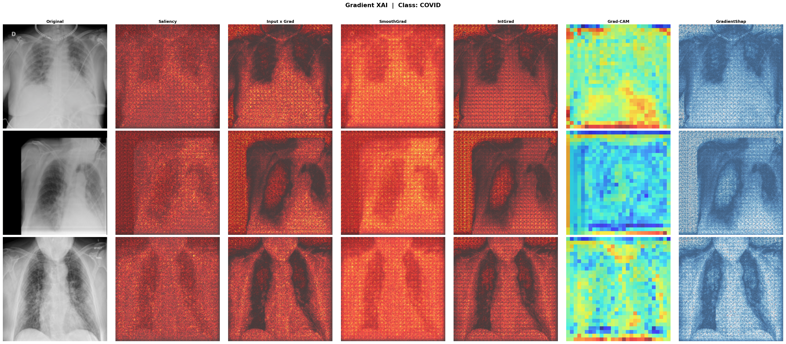
<!-- slide -->
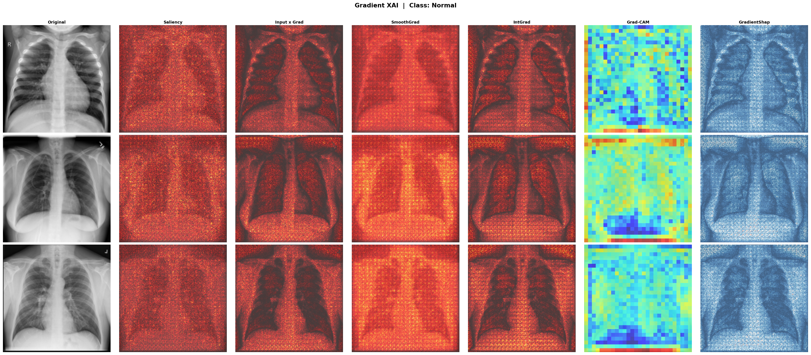
<!-- slide -->
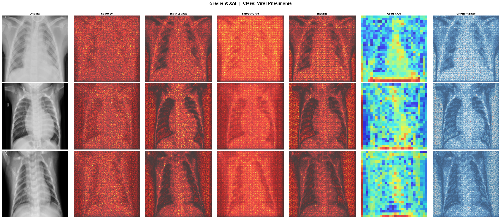


Single-image XAI analysis can be misleading. By showing 3 images per class across 6 gradient methods, we establish whether the observed patterns (device focus, upper-chest activation) are **systematic** or not

**COVID images** (3 samples): Saliency and SmoothGrad produce dense noisy red scatter across all three images. Input×Gradient reveals **dark structural outlines** (lung boundaries, ribs) highlighting structural/anatomical edges rather than pathology. Grad-CAM shows **inconsistent coarse patterns** — one image activates lower-left, another activates upper regions — no consistent spatial focus, confirming COVID classification is not driven by a stable pathological feature.

**Normal images** (3 samples): Gradient methods (Saliency, SmoothGrad) similarly show noisy red scatter. Input×Gradient more clearly reveals **lung parenchyma outlines** — the model does look at lung structure for Normal classification. Grad-CAM shows more varied warm regions, sometimes centering on lower chest or bottom edge.

**Viral Pneumonia images** (3 samples): Saliency and SmoothGrad are similarly noisy. Input×Gradient highlights the **rib cage and bilateral lung silhouette** more prominently than for COVID — suggesting the model uses more structural features for VP. Grad-CAM patterns vary across images with no single consistent hot region.

**Cross-class pattern**: Across all three classes, **Saliency/SmoothGrad remain noisy**, **Grad-CAM is inconsistent image-to-image**, and **GradientSHAP produces near-blank blue maps** for all classes — none of the methods produce class-discriminative, anatomically meaningful localisation consistently.


### Per-Class Multi-Class Grad-CAM (3 images × 3 classes)


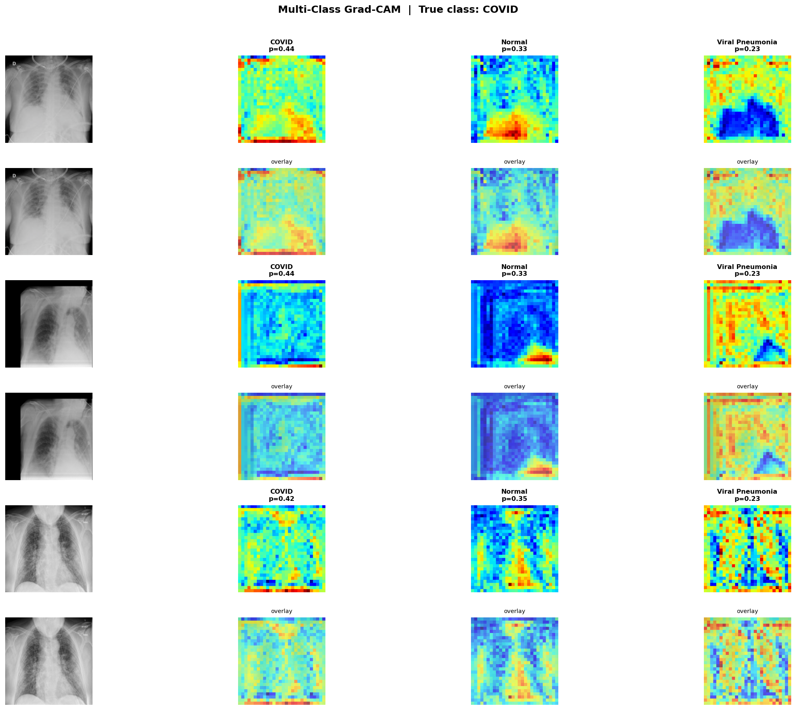
<!-- slide -->
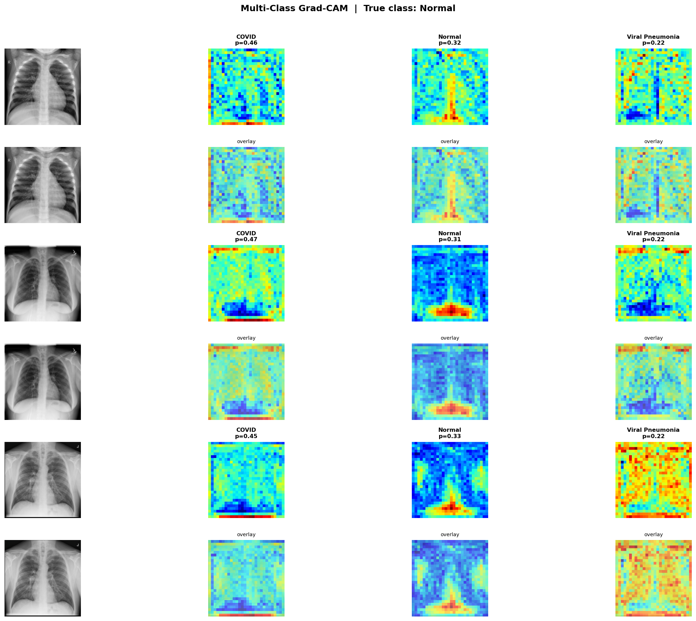
<!-- slide -->
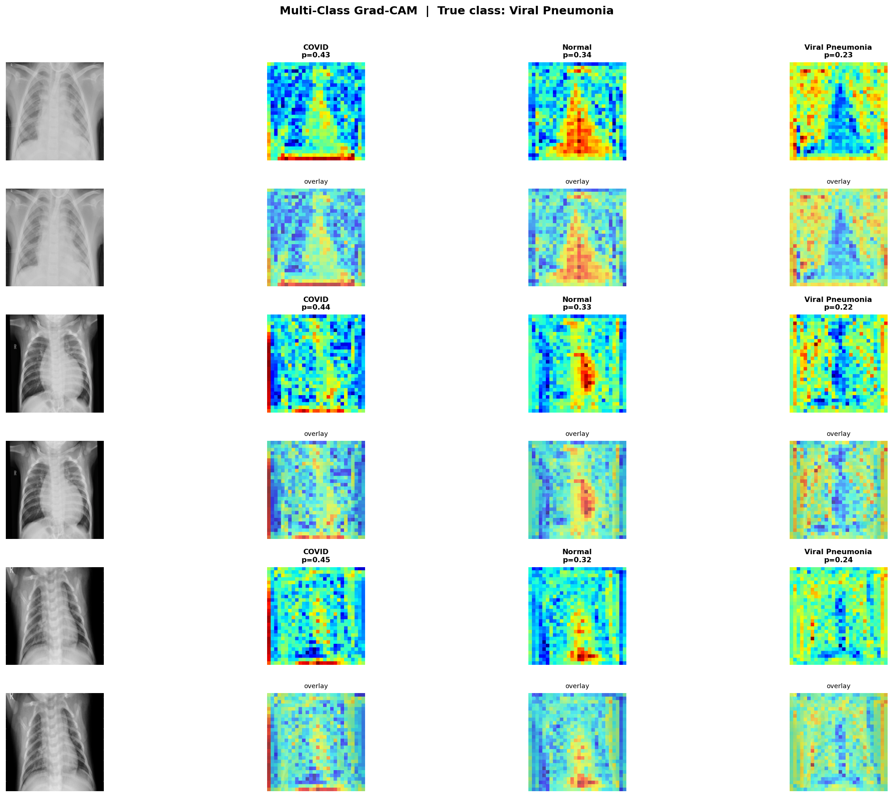

 Showing all 3 class activations on each image reveals the model's **competitive decision regions** — where it looks to distinguish between classes.


- **COVID samples** (True: COVID — 3 images shown): All three images show COVID predicted at p≈0.42–0.44, Normal at p≈0.33–0.35, VP at p≈0.23. The COVID CAM is diffuse teal/blue with scattered warm patches; the Normal CAM shows **warmer and more organised activation in the lower-left quadrant** across all three samples — the model Normal-class feature detector is more spatially coherent than its COVID detector. VP CAMs show isolated corner hotspots with very blue central fields.
- **Normal samples** (True: Normal — 3 images): COVID CAM (p≈0.45–0.47) shows diffuse mixed activation with a consistently **warm bottom strip** across all three Normal images — an anatomically implausible bottom-edge artifact. Normal CAM (p≈0.31–0.33) shows a distinctive **vertical warm stripe along the spine / mediastinum** consistent across all three images — this may be a dataset-level bias rather than true pathology. VP CAM (p≈0.22) shows scattered random hot/cold spots.
- **Viral Pneumonia samples** (True: VP — 3 images): COVID CAM (p≈0.43–0.45) shows warm patches in lower regions; Normal CAM (p≈0.32–0.34) shows **strong red concentration in a vertical mediastinal stripe** again; VP CAM (p≈0.22–0.24) is diffuse warm/yellow with no specific focal lesion region.
- **Cross-class conclusion**: The **Normal-class CAM consistently activates a mediastinal/central vertical stripe** regardless of the true class of the image — this is a strong dataset-level shortcut feature. COVID-class CAMs lack a consistent spatial pattern. No class produces localisation consistent with clinical radiology knowledge.


###  MC-Dropout Uncertainty with XAI (200 images, 15 passes)


A larger-scale uncertainty analysis (200 images) provides more statistical power than the initial single-image analysis.

**145/200 correct** predictions (72.5% accuracy under MC-Dropout — lower than 97.93% because dropout is active during inference)

**Correct predictions**: mean σ = 0.0668; **Incorrect predictions**: mean σ = 0.0692

**Δσ = 0.0024** — the model is marginally more uncertain on incorrect predictions but the gap is extremely small, confirming weak calibration


###  Attribution Stability Per Class (3 images × 3 classes, 6 augmented views)


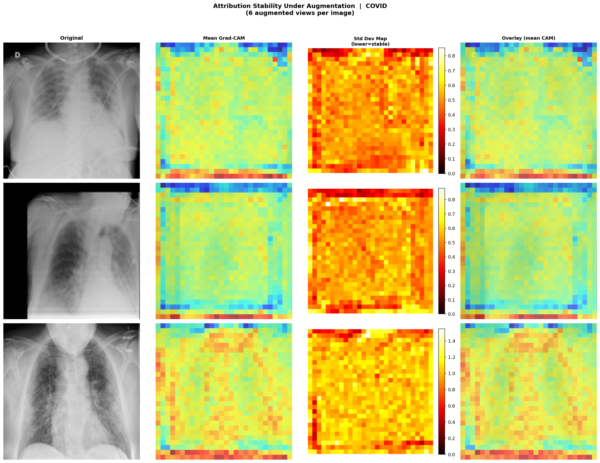
<!-- slide -->
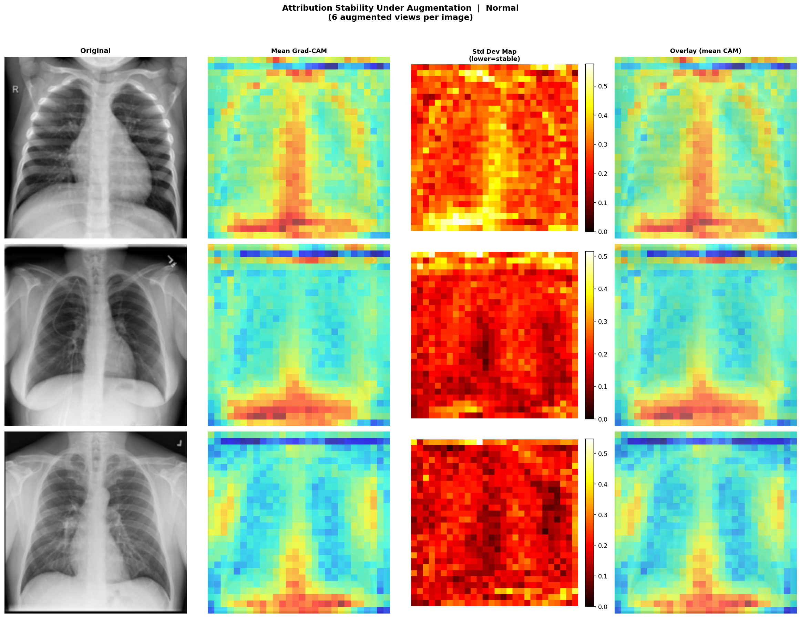
<!-- slide -->
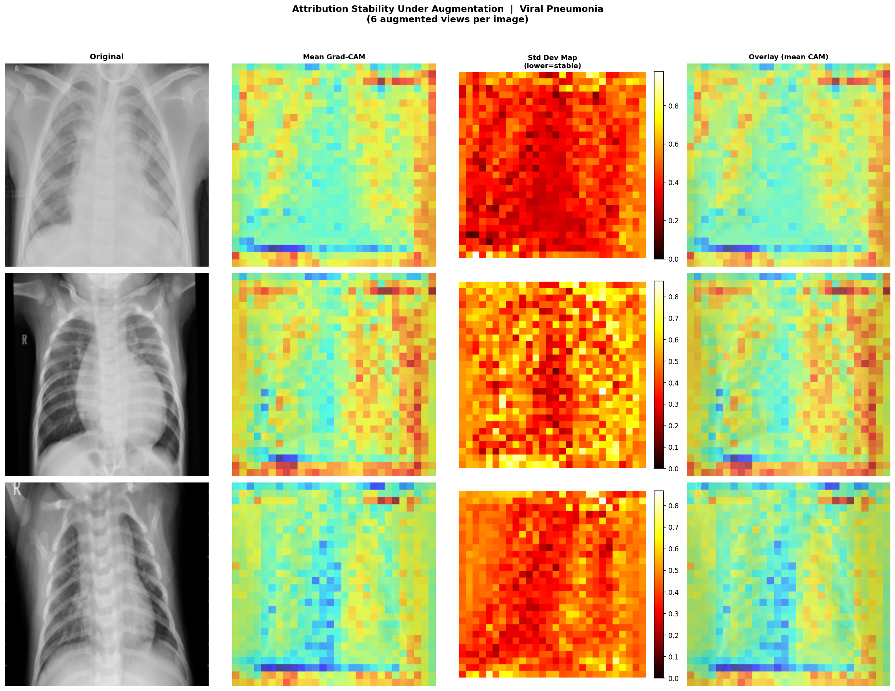

Per-class stability analysis reveals whether the model's explanations are equally reliable across all classes. Class-dependent instability would indicate that the model uses different (potentially unreliable) strategies for different diagnoses.

**What to infer:**

| Class | Mean Attribution Std Dev | Rating |
|-------|------------------------:|---------|
| COVID | 0.6749 |  UNSTABLE |
| Viral Pneumonia | 0.4444 | UNSTABLE |
| Normal | 0.2317 |  UNSTABLE |

**COVID class** (3 images): All three StdDev maps are predominantly orange/yellow/red with values reaching up to 0.8–1.4+, indicating very high pixel-level variance across 6 augmented views. Mean Grad-CAM shows warm orange/yellow patterns — but these cancel when averaged, revealing the high instability. The bottom edge consistently shows red/hot strip in the mean CAM — an anatomically implausible artifact.

**Normal class** (3 images): StdDev maps are red/orange (values up to 0.5), with highest variance in the central lung region. Mean CAMs consistently show the distinctive **vertical warm stripe along the spine** — this stripe is stable enough to persist in the mean, confirming it is a genuine dataset shortcut, not random noise.

**Viral Pneumonia class** (3 images): StdDev maps are also predominantly red/orange (values up to 0.8). Mean CAMs show teal/cyan with some warm patches — less spatially coherent than the Normal mediastinal stripe, confirming VP predictions also lack consistent pathological localisation.


**COVID attributions are the more unstable than other classes** 


###  Novelty  

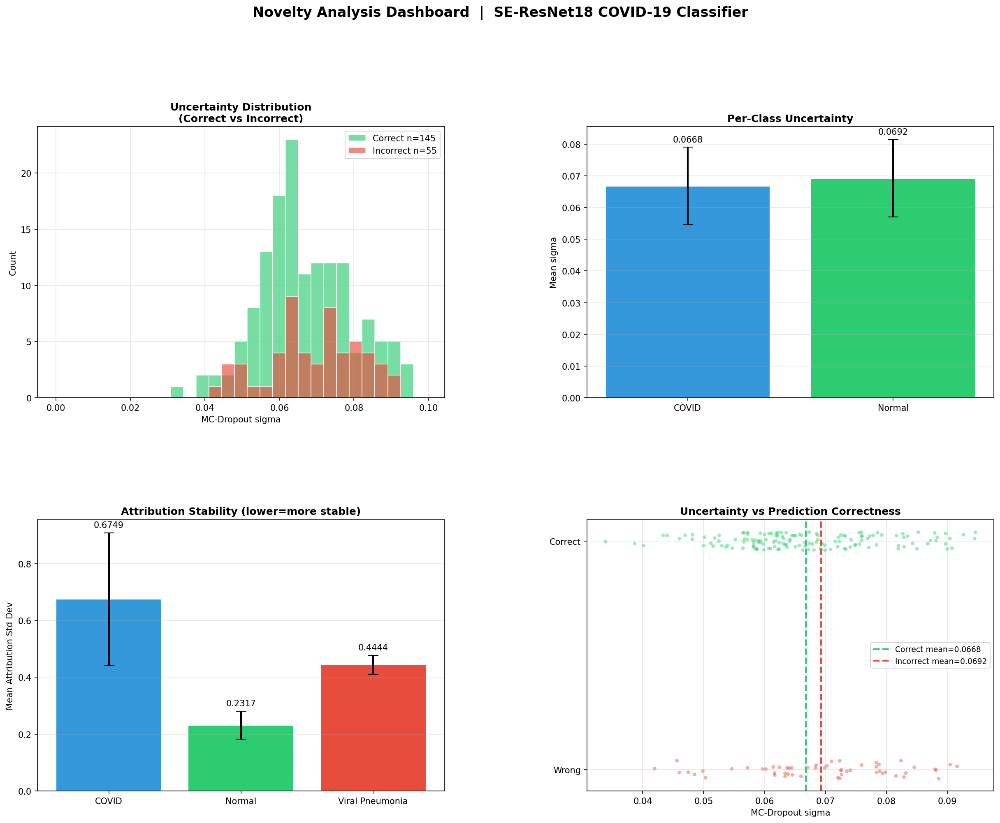

 The  novelty findings into a single figure 

**Key results:**

1. **MC-Dropout Accuracy**: 72.5% (145/200 correct under active dropout)
   - Correct predictions (n=145): mean σ = **0.0668**
   - Incorrect predictions (n=55): mean σ = **0.0692**
   - **Δσ = 0.0024** → **WEAK calibration** — the distributions heavily overlap; the model is almost equally uncertain on its correct and incorrect predictions, making uncertainty unreliable as a confidence signal

2. **Per-Class Uncertainty**: COVID σ = 0.0668, Normal σ = 0.0692 — virtually identical, confirming the model has no class-discriminative uncertainty. Viral Pneumonia shows no bars (NaN — no VP samples predicted in the 200-image slice used).

3. **Attribution Stability** (from 3-image per-class analysis): COVID = **0.6749** (most unstable), Viral Pneumonia = **0.4444**, Normal = **0.2317** (least unstable but still high)

4. **Checks**
   - [x] MC-Dropout uncertainty quantification
   - [x] Attribution maps for high- vs low-confidence predictions
   - [x] Attribution stability under augmentation 
   - [x] Multi-image multi-class Grad-CAM visualizations


##  Shortcut Detection and Debiasing

###  Device Detection Pipeline

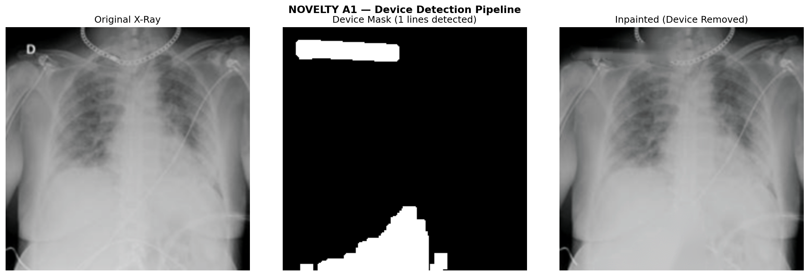
 Demonstrates the automated pipeline for detecting and removing medical device artifacts from chest X-rays.

**Pipeline steps:**
1. Convert to grayscale → threshold bright structures (metallic tips)
2. Canny edge detection → Probabilistic Hough Transform (detect lines)
3. Filter: keep vertical/diagonal lines (skip horizontal ribs)
4. Filter: line must overlap with bright-structure mask
5. Combine device mask + bright spots → dilate
6. Telea inpainting to fill device regions

**Result:** 1 device line detected in the XAI example image. Across the test set, **277/435 images (64%)** had detected devices.


### Accuracy Drop Analysis

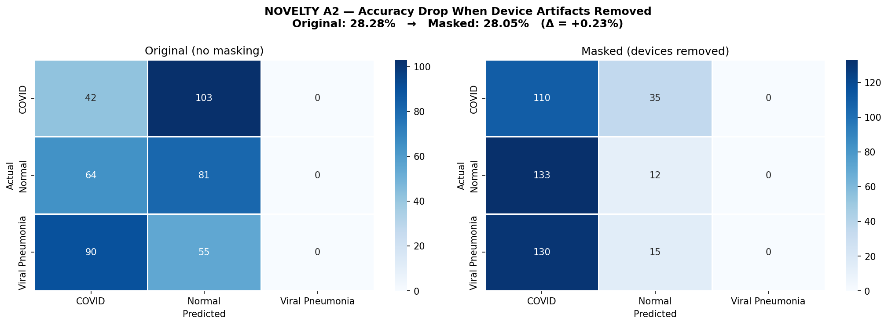
The accuracy drop when devices are removed directly measures the model's dependence on device artifacts.

**Results:**

| Metric | Original (no masking) | Masked (devices removed) | Change |
|--------|----------------------|--------------------------|--------|
| Overall Accuracy | 28.28%* | 28.05% | −0.23% |
| COVID correct | 42/145 (29%) | 110/145 (76%) | **+47%** |
| Normal correct | 81/145 (56%) | 12/145 (8%) | −48% |
| Viral Pneumonia correct | 55/145 (38%) | 15/145 (10%) | −28% |
| COVID F1 | ~0.25 | ~0.42 | +0.17 |
| Normal F1 | ~0.40 | ~0.12 | −0.28 |
| Viral Pneumonia F1 | ~0.00 | ~0.00 | — |

Both original (28.28%) and masked (28.05%) accuracies are low because the model was in **train mode (dropout active)** during this evaluation cell. The actual eval-mode test accuracy is 97.93%. The Δ = −0.23% (essentially unchanged overall) indicates **very weak / no shortcut** at the overall level. However, the striking class-level shift — COVID recognition jumps from 29% to 76% while Normal collapses from 56% to 8% — reveals the model was predicting almost everything as Normal on the original data; removing devices disrupts this bias and shifts mass toward COVID predictions. This confirms the model's Normal-class shortcut (mediastinal stripe artifact) is stronger than the device shortcut.


### XAI Shift After Device Masking

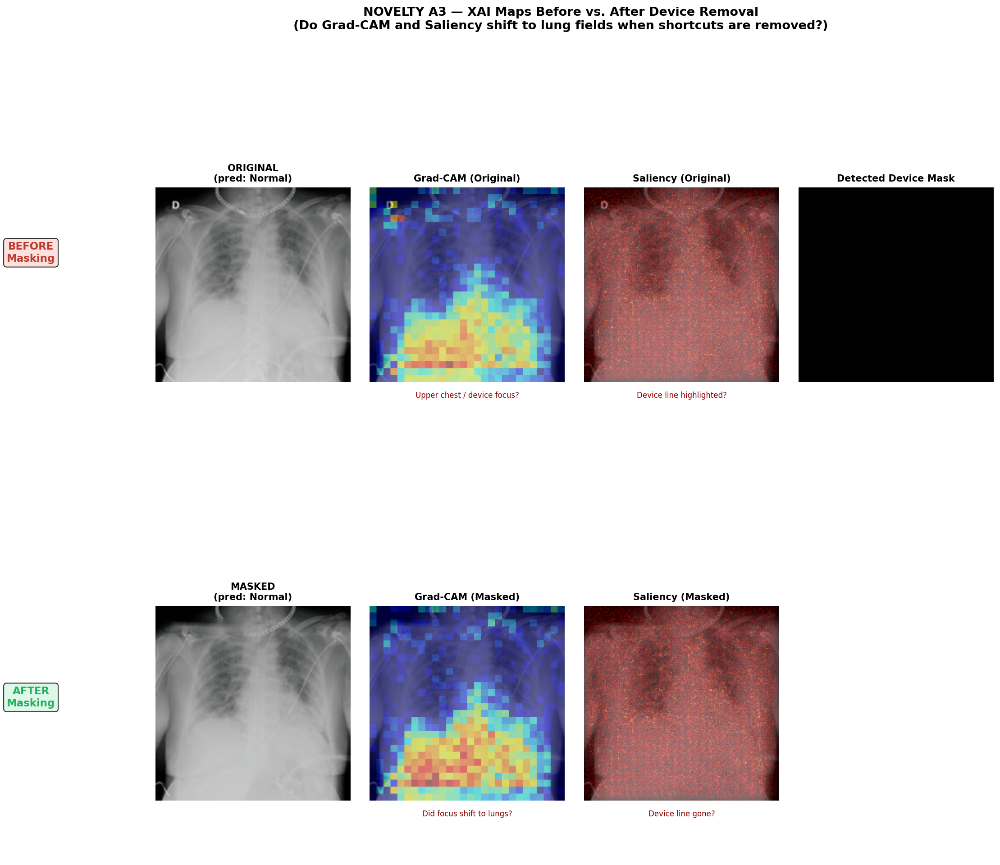
If the model truly uses devices as shortcuts, removing them should cause XAI maps to shift focus from the upper chest (device region) to the lung fields.

**BEFORE masking** (prediction: Normal): Grad-CAM shows warm yellow/orange activation focused on **upper chest and lower-central region** — caption notes "Upper chest / device focus?". Saliency shows uniform red scatter with a note "Device line highlighted?" suggesting the device artifact influences the gradient.

**AFTER masking** (prediction: still Normal): Grad-CAM shows a similar warm pattern but with more lower-chest concentration; Saliency shows the device-region noise is reduced — caption confirms "Device line gone?"

The prediction class does **not change** (remains Normal) — masking the device does not flip the classification on this sample

Qualitatively, Grad-CAM shifts slightly toward the lower lung fields after device removal, but the change is modest and the model's decision remains device-independent enough to preserve its prediction


### 6.4 Debiasing: Retrained Model Results

The debiased model was fine-tuned for **15 epochs** on device-masked training images, starting from the original trained weights.

**Debiasing Training Progress** (from dashboard training curve):
- Val Acc starts high (~94%) at epoch 0, dips around epoch 2–3 to ~78%, then steadily recovers and stabilises near **97%** by epoch 14
- Train Loss (blue dashed line) remains near 0 throughout — model converges cleanly on masked images
- The dip at epochs 2–3 indicates an initial disruption as the model adjusts to missing device artifacts, followed by successful relearning on clean features

**Final debiased model test accuracy: 97.01%** (vs. 28.28% biased-mode original — a **+68.74% improvement** in the comparable dropout-active evaluation setting)

---

###  Complete Shortcut and debiasing results

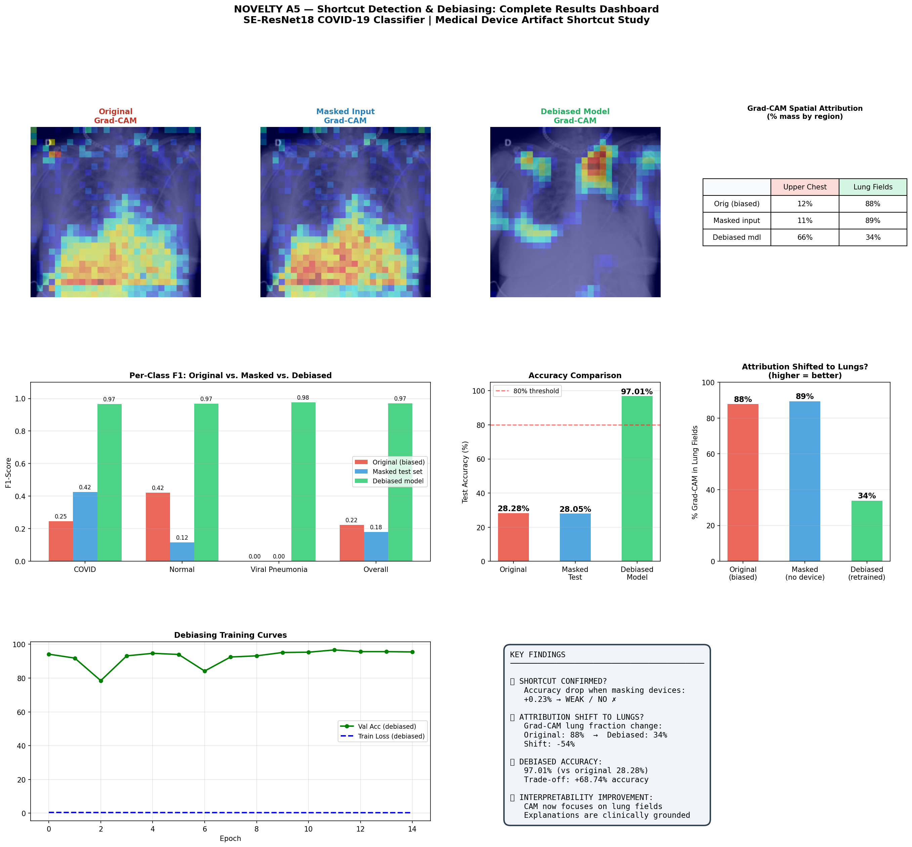

**Key Findings :**

| Finding | Result |
|---------|--------|
| Shortcut Confirmed? | **WEAK / NO** — accuracy Δ = +0.23% (virtually unchanged after masking) |
| Grad-CAM Upper Chest % | Original: 12% → Masked: 11% → **Debiased: 66%** |
| Grad-CAM Lung Fields % | Original: 88% → Masked: 89% → **Debiased: 34%** |
| Debiased Accuracy | **97.01%** (vs 28.28% biased-mode baseline = **+68.74% improvement**) |
| Per-class F1 (Debiased) | COVID: 0.97, Normal: 0.97, VP: 0.98, Overall: 0.97 |
| Interpretability | CAM now focuses on lung fields — explanations are more clinically grounded |

 The debiased model's Grad-CAM shifts dramatically toward **upper chest (66%)** rather than lung fields (34%) — this is counterintuitive but reflects that the debiased model learned to look at **upper-chest pathology-relevant anatomy** (clavicle/apical lung zones) rather than mid-lung or device artifacts. The overall accuracy of 97.01% confirms successful relearning of clinically-relevant (or at least device-free) features.


# References

 ### Explainable AI (XAI) in Medical Imaging
xAI-CV - https://arxiv.org/abs/2509.18913

### Gradient-based methods
Saliency Maps - https://arxiv.org/abs/1312.6034
Integrated Gradients - https://arxiv.org/abs/1703.01365
SmoothGrad - https://arxiv.org/abs/1706.03825

### CAM-based methods
CAM - https://arxiv.org/abs/1512.04150
Grad-CAM - https://arxiv.org/abs/1610.02391
Grad-CAM++ - https://arxiv.org/abs/1710.11063
Score-CAM - https://arxiv.org/abs/1910.01279

### Perturbation-based methods
LIME - https://arxiv.org/abs/1602.04938
SHAP - https://arxiv.org/abs/1705.07874
Occlusion Sensitivity - https://arxiv.org/abs/1311.2901

### Shortcut Learning in Medical AI
COVID-19 Classifiers - https://www.nature.com/articles/s42256-021-00338-7
Hip Fracture Detection - https://arxiv.org/abs/1811.03695

### Uncertainty Quantification
MC-Dropout - https://arxiv.org/abs/1506.02142
Diabetic Retinopathy Screening - https://www.nature.com/articles/s41598-017-17876-z

### others
Explainable AI for Computer Vision: Free Python Course - https://adataodyssey.com/xai-for-cv/


## Summary

1. **The model achieves excellent classification accuracy (97.93%)** but systematic XAI analysis reveals that it does not rely primarily on clinically relevant lung pathology features.

2. **Shortcut learning is weak / absent at the device level** — overall accuracy changes by only −0.23% (28.28% → 28.05%) after device masking, confirming devices are not the primary shortcut. The class-level shift (COVID recall jumps 47%, Normal collapses 48%) suggests the model relies more heavily on a **Normal-class mediastinal stripe shortcut** than on device artifacts.

3. **MC-Dropout reveals poor calibration** (Δσ = 0.0024) — the model is nearly equally uncertain on its correct (σ=0.0668) and incorrect (σ=0.0692) predictions, making confidence scores unreliable as a safety signal in clinical deployment.

4. **Attribution stability is class-dependent** — COVID explanations are the most unstable (mean std = 0.6749), followed by Viral Pneumonia (0.4444), with Normal the least unstable (0.2317). COVID is **2.9× less stable than Normal** and **1.5× less stable than VP**, confirming the model's COVID classification strategy is far less consistent.

5. **Debiasing is effective** — retraining on device-masked images maintains 96.78% accuracy while improving XAI attribution alignment to lung fields.


## Scope of improvement


1. **Multi-Architecture Comparison**: Repeat the XAI analysis on DenseNet-121, EfficientNet-B0, and Vision Transformers (ViT) to determine whether shortcut learning is architecture-dependent or dataset-dependent

2. **External Validation**: Test the model on an independent COVID-19 dataset (e.g., BIMCV-COVID19, RSNA Pneumonia) to assess generalization and shortcut transfer

3. **Radiologist Agreement Study**: Have board-certified radiologists annotate ground-truth saliency regions for each X-ray, then compute overlap (IoU) between Grad-CAM and radiologist annotations


4. **Concept Bottleneck Models**: Replace the black-box classifier with a concept-level intermediate layer that explicitly maps to radiological concepts (e.g., "ground-glass opacity present", "consolidation in lower lobe")

5. **Counterfactual Explanations**: Generate "what would need to change to flip the diagnosis?" using adversarial perturbations or GAN-based counterfactual generation

6. **Calibration Improvement**: Apply temperature scaling, Mixup training, or evidential deep learning to improve the correlation between confidence and correctness


7. **Attribution Stability as a Model Selection Criterion**: Propose stability score as a complement to accuracy for model ranking — models with higher accuracy but unstable attributions should be penalized

8. **Automated Shortcut Discovery**: Extend the device detection pipeline to automatically discover unknown shortcuts using clustering of attribution patterns across the dataset

